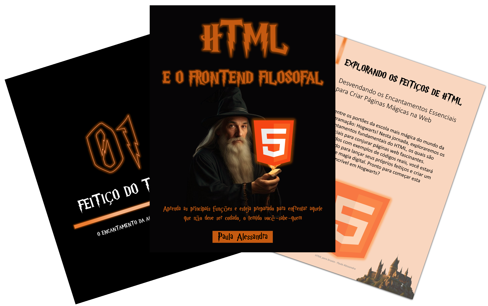

    

-------

# Projeto EBOOK Gerado por I.A.s

> ℹ️ **NOTE:** Este é um repositório desenvolvido durante o curso CHATGPT FOR DEVS da [DIO](https://dio.me).

Projeto com o objetivo de gerar um ebook digital com as facilidades das ferramentas de IA. todos os prompts
seguem abaixo.

<a href="https://github.com/felipeAguiarCode/prompts-recipe-to-create-a-ebook/blob/main/output/ebook%20-%20css%20jedi%20output.pdf" title="View PDF now"> 📕Clique aqui para ler</a>

## 💻 Tecnologias utilizadas no projeto

- [ChatGPT](https://chat.openai.com/) 
- [Leonardo AI](https://www.leonardo.ai)
- [PowerPoint](https://www.microsoft.com/en/microsoft-365/powerpoint)

## 🧠 Prompts

ChatGPT：

|   Ação   | prompt                                                                                                                                                                                                                                                                         |
| :------: | ------------------------------------------------------------------------------------------------------------------------------------------------------------------------------------------------------------------------------------------------------------------------------ |
|  título  | Crie um título de um ebook sobre o tema de HTML, o ebook é do nicho de programação e o subnicho é de HTML, o título deve ser épico e curto, e tenha uma temática de Harry Potter no título, me liste 5 variações de títulos                                                        |
| conteúdo | Faça um texto para ebook, com foco em HTML, listando os principais funções em HTML, com exemplos em código {REGRAS}. Explique sempre de uma maneira simples e deixe o texto enxuto, sempre traga exemplos de código em contextos reais, sempre deixe um título sugestivo por tópico |

Leonardo.Ai：

|  Ação  | prompt                                                                                 |
| :----: | -------------------------------------------------------------------------------------- |
| título | An old wizard with a black background color, in a harry potter style |

## ✨ Features

- Conteúdo gerado via ChatGPT
- Imagens geradas via Leonardo AI

## 📚 Materiais

- Imagens utilizadas em `assets`
- ebook gerado durante as aulas em `output`

## 🛠️ Instruções de execução

Utilize os prompts acima nas ferramentas sugeridas para gerar o material base e utilize uma ferramenta de edição de documentos como power point, libreoffice , indesign para diagramação.

## 👨‍💻 Expert

    
    
&nbsp&nbsp&nbspPaula Alessandra 
    &nbsp&nbsp&nbsp
    <a href="https://github.com/paulaalessandrars">
    GitHub</a>&nbsp;|&nbsp;
    <a href="https://www.linkedin.com/in/paula-alessandra-rodrigues-dos-santos-57586759/">LinkedIn</a>
&nbsp;|&nbsp;
    <a href="https://www.instagram.com/paulaalessandrars/">
    Instagram</a>
&nbsp;|&nbsp;

  

---

⌨️ com 💗☕ por [Paula Alessandra](https://github.com/paulaalessandrars)
